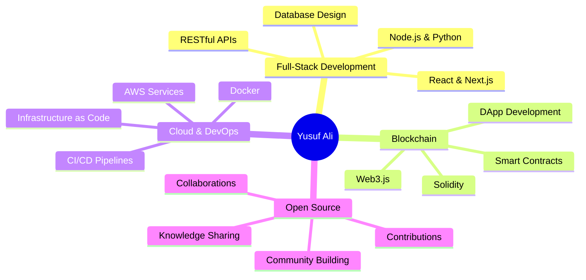

<div align="center">


[](https://git.io/typing-svg)

<p align="center">
  
  
  
</p>

<p align="center">
  <a href="https://ali-3d-portfolio.vercel.app" target="_blank">
    
  </a>
  <a href="mailto:yusufdupsc1@gmail.com">
    
  </a>
  <a href="https://linkedin.com/in/yusuf-ali-16b890216" target="_blank">
    
  </a>
  <a href="https://twitter.com/EsrafilSaikot" target="_blank">
    
  </a>
  <a href="https://dev.to/yusufdupsc1" target="_blank">
    
  </a>
</p>

<p align="center">
  <a href="https://github.com/yusufdupsc1" target="_blank">
    
  </a>
  <a href="https://stackoverflow.com/users/22302835/yusuf-ali" target="_blank">
    
  </a>
  <a href="https://www.youtube.com/channel/UC3rck9PkVZw4-WhO6IfIieg" target="_blank">
    
  </a>
  <a href="https://www.facebook.com/profile.php?id=100007791609164" target="_blank">
    
  </a>
</p>


</div>

---


### 👨‍💻 About Me

```typescript
class FullStackDeveloper {
    name: string = "Yusuf Ali";
    location: string = "🇧🇩 Dhaka, Bangladesh";
    role: string = "Full-Stack Developer";
    
    skills = {
        frontend: ["JavaScript", "TypeScript", "React.js", "Next.js"],
        backend: ["Python", "Django", "PHP", "Laravel", "Node.js"],
        styling: ["Tailwind CSS", "CSS3", "SCSS", "Bootstrap"],
        databases: ["PostgreSQL", "MongoDB", "MariaDB", "MySQL"],
        cloud: ["AWS", "Vercel", "Docker", "Netlify"],
        tools: ["Git", "Linux", "Bash", "WordPress"]
    };
    
    architecture = [
        "Microservices",
        "RESTful APIs",
        "Event-Driven Design",
        "System Design",
        "Database Optimization"
    ];
    
    currentFocus = [
        "🔗 Blockchain & Smart Contracts (Solidity)",
        "☁️ AWS Cloud Architecture & DevOps",
        "🎨 Advanced UI/UX Design Patterns",
        "🔐 Web Security Best Practices"
    ];
    
    portfolio = "https://ali-3d-portfolio.vercel.app";
    funFact = "I'm secretly a penguin lover 🐧 (but don't tell anyone!)";
    
    getMotivation(): string {
        return "Building scalable systems that make a difference! 🚀";
    }
}

const yusuf = new FullStackDeveloper();
console.log(yusuf.getMotivation());
```

### 🚀 Current Projects

- 🔭 **Working On:** [Next.js Full-Stack Applications](https://ali-fullstact-nextjs-yusufdupsc1.vercel.app)
- 🌱 **Learning:** Blockchain Development, Smart Contracts, Web3.js
- 👯 **Open to Collaborate:** JavaScript, React, Next.js, Python, Django, Web Scraping
- 💬 **Ask Me About:** System Design, Backend Architecture, Database Optimization, Cloud
- 📝 **I Write About:** System Design, Security, Databases, AWS, Blockchain

<br clear="right"/>

---

<h2 align="center">🛠️ Technologies & Tools</h2>

<div align="center">

### Frontend Development


### Backend Development


### Databases & Cloud


### Tools & DevOps


</div>

---

<h2 align="center">📊 GitHub Statistics</h2>

<div align="center">
  
  
</div>

<div align="center">
  
  
</div>

<div align="center">
  
</div>

---

<h2 align="center">🏆 GitHub Trophies</h2>

<div align="center">
  
</div>

---

<h2 align="center">📈 Contribution Activity</h2>

<div align="center">
  
[](https://github.com/yusufdupsc1)

</div>

---

<h2 align="center">🐍 Contribution Snake</h2>

<div align="center">
  
<picture>
  <source media="(prefers-color-scheme: dark)" srcset="https://raw.githubusercontent.com/yusufdupsc1/yusufdupsc1/output/github-contribution-grid-snake-dark.svg">
  <source media="(prefers-color-scheme: light)" srcset="https://raw.githubusercontent.com/yusufdupsc1/yusufdupsc1/output/github-contribution-grid-snake.svg">
  
</picture>

</div>

---

<h2 align="center">💭 Random Dev Quote</h2>

<div align="center">


</div>

---

<h2 align="center">📝 Latest Blog Posts</h2>

<div align="center">

<!-- BLOG-POST-LIST:START -->
<!-- BLOG-POST-LIST:END -->

> 📌 **Note:** Blog posts will auto-update here when you set up the workflow

</div>

---

<h2 align="center">🎯 2025 Goals</h2>

<div align="center">

```yaml
professional_goals:
  - "🚀 Master Blockchain & Smart Contract Development"
  - "☁️ Obtain AWS Solutions Architect Certification"
  - "💼 Contribute to 10+ Open Source Projects"
  - "📝 Write 50+ Technical Blog Posts"
  - "🎓 Mentor 25+ Aspiring Developers"
  
technical_goals:
  - "⚡ Build 5+ Production-Ready Web3 DApps"
  - "🔧 Optimize Backend Systems for 10x Performance"
  - "🎨 Create Stunning UI/UX for 20+ Projects"
  - "📊 Implement Advanced System Designs"
  - "🔐 Master Security Best Practices"

personal_goals:
  - "🌱 Learn 3+ New Technologies"
  - "🤝 Network with Industry Leaders"
  - "🏆 Win a Hackathon"
  - "🎤 Speak at Tech Conferences"
  - "📚 Read 12 Tech Books"
```

</div>

---

<h2 align="center">💼 Open to Opportunities</h2>

<div align="center">



<p>
  <strong>🔍 I'm actively seeking:</strong><br>
  Full-Stack Developer Roles • Blockchain Projects • Open Source Collaborations • Freelance Opportunities
</p>

</div>

---

<h2 align="center">📫 Let's Connect & Build Something Amazing!</h2>

<div align="center">

<table>
  <tr>
    <td align="center" width="33%">
      
      <br><strong>Code Together</strong>
      <br>Open to collaborations on<br>exciting projects
    </td>
    <td align="center" width="33%">
      
      <br><strong>Learn Together</strong>
      <br>Share knowledge and<br>grow together
    </td>
    <td align="center" width="33%">
      
      <br><strong>Chat About Tech</strong>
      <br>Discuss ideas, trends<br>and innovations
    </td>
  </tr>
</table>

<p>
  <a href="mailto:yusufdupsc1@gmail.com">
    
  </a>
  <a href="https://linkedin.com/in/yusuf-ali-16b890216" target="_blank">
    
  </a>
  <a href="https://ali-3d-portfolio.vercel.app" target="_blank">
    
  </a>
</p>

---

### ⭐ Fun Facts About Me

- 🐧 **Secret Love:** Penguins (they're just so cool!)
- ☕ **Fuel:** Coffee and Code
- 🎮 **Hobbies:** Gaming, Reading Tech Blogs, Building Side Projects
- 🌍 **Dream:** Travel the world while working remotely
- 💡 **Philosophy:** "Code is poetry, and I'm a poet"

---

<p align="center">
  
</p>

<p align="center">
  <strong>💙 If you like my work, consider giving a ⭐ to my repositories!</strong>
</p>

<p align="center">
  
  
</p>

</div>

---

<div align="center">


**Made with ❤️ and lots of ☕ by Yusuf Ali**

© 2025 Yusuf Ali • All Rights Reserved

<sub>Last Updated: October 2025</sub>

</div>
